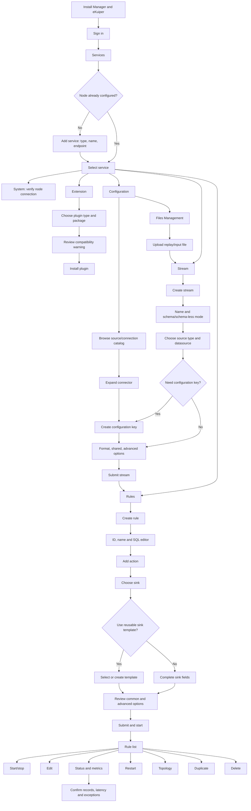
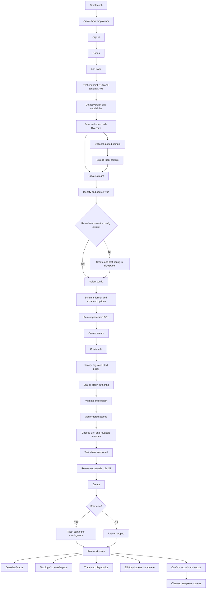

# Original eKuiper Manager UX Audit

**Audit date:** 18 August 2026
**Reference product:** live EMQX `emqx/ekuiper-manager:1.8.0`, static `1.9.5-plus-ief` teardown, and official eKuiper UI tutorials
**Purpose:** Reconstruct the original UI screen by screen, compare it with this repository, and define which interaction patterns should shape the self-hosted Manager.

## 1. Scope and evidence

The original Manager was distributed as a container rather than as an open-source application. The audit began with its incomplete public documentation, then installed an isolated stock 1.8.0 Manager/eKuiper pair and inspected every reachable screen, form branch, modal, dropdown, and lifecycle that could be exercised without installing untrusted plugin code. Bundled source maps were used to verify empty-state row operations and conditional branches that could not be populated safely. A separate user-supplied 1.9.5-plus-IEF teardown supplied later static evidence.

Primary evidence:

- [EMQX Docker image documentation for eKuiper Manager 1.8](https://hub.docker.com/r/emqx/ekuiper-manager)
- [Official legacy Manager console guide](https://docs.emqx.com/en/kuiper/latest/operation/manager-ui/overview.html)
- [Official eKuiper 2.1 getting-started UI workflow](https://ekuiper.org/docs/en/v2.1/getting_started/getting_started.html)
- [Official eKuiper 2.2 UI example/replay workflow](https://ekuiper.org/docs/en/v2.2/example/howto.html)
- [Official current eKuiper configuration guide](https://ekuiper.org/docs/en/latest/configuration/configuration.html)

The audit inspected the official screenshots for login, node creation, plugin installation, stream creation, configuration keys, rule creation, action creation, rule lists, and rule status. It then verified those flows against the live local installation. Screenshots and vendor assets are not copied into this repository.

Evidence limits:

- The public guide documents only sign-in, but the live product has Users and Roles administration plus self-service Change Password. It has no distinct administrator reset-password flow.
- No native plugin, service package, or portable package was submitted because that would execute newly acquired code. Their forms were inspected live and their installed-row branches were verified from shipped source maps.
- Destructive delete actions were not executed. Confirmation, routing, and post-delete behavior were verified from the live controls and shipped source maps.
- Different pages describe Manager 1.4, 1.8, and later eKuiper examples. Labels and navigation changed between those releases.
- The old UI predates many eKuiper v2.4.1 APIs. It is a UX reference, never an API-contract authority.

## 2. Executive decision

Do not clone the original Manager's appearance or old product structure. Adopt the parts that reduce operator effort:

1. Make the selected eKuiper node the clear context for every operational screen.
2. Let users create a missing connector configuration or sink template from the stream/rule form where it is needed.
3. Present installed capabilities as a discoverable connector catalog with descriptions, status, documentation, and actions.
4. Keep common fields visible and put specialist fields in an explicit Advanced section.
5. Put rule start/stop and status directly in the list; do not bury the primary lifecycle in a menu.
6. Make “create a stream → create a rule → observe data” a guided first-success journey.

Keep the current project's stronger concepts: richer node health, tables, schemas, imports/exports, tracing, API docs, responsive layout, accessible labels, and version/capability awareness.

## 3. Original information architecture

The most useful original pattern was a two-level hierarchy:

1. **Services** represented managed eKuiper nodes.
2. Selecting a service opened a node-scoped workspace with five primary tabs:
   - Stream
   - Rules
   - Extension
   - Configuration
   - System

Within Configuration, the documented secondary tabs were:

- Source Config
- Connection
- Files Management in later tutorials

The selected node appeared in a breadcrumb such as `Services / <node>`. This made it much harder to forget which engine an operation would affect.

## 4. Complete documented original flow

### First-run/node flow

1. Start the Manager and eKuiper containers.
2. Sign in.
3. Open Services.
4. Add a direct-link service with service type, display name, and endpoint.
5. Select the node.
6. Open System to confirm that the Manager can reach the eKuiper REST API.

What worked:

- Only three fields were required to register a node.
- The node became the parent context for all remaining tasks.
- A default endpoint could be supplied at deployment time.

What should change:

- Test the connection before save and show the detected version/capabilities.
- Put TLS, JWT, timeouts, and certificate validation in Advanced settings.
- Never ship `admin/public` or another default credential.
- Only allow server-registered targets; do not recreate the old unrestricted reverse proxy.

### Plugin prerequisite flow

1. Enter the selected node's Extension tab.
2. Choose the plugin category.
3. Choose a prebuilt plugin; its package URL is filled automatically.
4. Review a prominent runtime/platform compatibility warning.
5. Optionally add installer parameters.
6. Install and return to the node workspace.

What worked:

- The catalog converted package URLs into a discoverable selection.
- Compatibility risk was placed in the workflow before installation.
- Plugin availability and documentation were visible beside the capability.

What should change:

- Derive the catalog and status from the connected v2.4.1 node.
- Show build/OS/architecture compatibility and restart requirements before confirmation.
- Display progress and final portable/native status.
- Treat package URL and shell parameters as privileged, validated input.

### Connector/configuration flow

1. Open Configuration → Source Config or Connection.
2. Browse a catalog with connector name, description, trial status, installed status, and actions.
3. Expand a connector to reveal its named configuration keys.
4. Add, inspect, or delete a key without losing the connector context.
5. Use inline help icons and connector documentation while completing a metadata-driven form.

What worked especially well:

- Discovery, installation state, documentation, and configuration were on one screen.
- Expand-in-place kept the catalog navigable while showing reusable resources.
- The user learned that a configuration key is a reusable object, not an arbitrary string.

What should change:

- Replace the old “trial” flag with clearer capability badges such as Built in, Plugin, Installed, Unavailable, Experimental, or Deprecated.
- Provide Test connection before save.
- Never return an existing secret value to the form; show `Configured` and allow replacement.
- Use the v2.4.1 metadata/YAML contract rather than static field definitions.

### Stream flow

1. Open Stream and choose Create Stream.
2. Enter a stream name.
3. Choose structured or schema-less input.
4. Choose source type.
5. Enter the connector-specific datasource, such as an MQTT topic.
6. Select a configuration key or create one in context.
7. Select event format and shared-source behavior.
8. Optionally use visualization mode or raw definition mode.
9. Submit and return to the list.

What worked:

- The form matched the user's mental model: identity → connector → reusable connection → data shape.
- “Add configuration key” was beside the selector that needed it.
- Common defaults reduced the number of required decisions.

What should change:

- Use a stepped page or side panel rather than one very tall form.
- Show a live SQL/DDL preview and let visual/raw modes round-trip without data loss.
- Detect formats and schemas from node capabilities.
- Validate name, datasource, format/schema compatibility, and configuration key before creation.

### Rule authoring flow

1. Open Rules and choose Create Rule.
2. Enter ID and optional display name.
3. Write SQL in a syntax-highlighted editor with completion.
4. Add one or more actions.
5. For each action, select its sink, optionally select/create a reusable sink template, and complete connector-specific fields.
6. Open Advanced for shared sink behavior such as `sendSingle`, templates, retries, and buffering.
7. Submit; the documented Manager started the rule automatically.

What worked especially well:

- SQL and its output actions were edited as one rule artifact.
- Actions were a visible ordered list with edit/delete controls.
- Sink documentation was one click from the action form.
- Common fields appeared first; Advanced reduced initial complexity.
- Reusable resource/template selection prevented repeated credentials and endpoints.

What should change:

- Add Validate and Explain before save.
- Let the user explicitly choose Start after creation; do not surprise them with activation.
- Add a review step showing source dependencies, actions, tags, options, and secret-safe diffs.
- Use accessible field labels and named action menus instead of unexplained icons.
- Preserve booleans, numbers, arrays, and nested values exactly through edit/save.

### Rule operations and observability flow

The original rule list put the lifecycle in one row:

- ID and display name
- Start/stop switch
- Edit
- Status/metrics
- Restart
- Topology
- Duplicate
- Delete

The status view showed runtime state and raw counters such as records in/out, latency, buffer length, last invocation, and exceptions.

What worked:

- Start/stop was visible and immediate.
- Status and duplicate were first-class rule operations.
- Operators could confirm that data was actually moving without leaving the rule area.

What should change:

- Keep start/stop visible, but show pending/starting/stopping/error states because eKuiper lifecycle requests are asynchronous.
- Replace icon-only operations with labels/tooltips and a responsive overflow menu.
- Replace raw metric-name dumps with summarized rates, totals, latency, buffer, and exception cards while retaining a raw view.
- Put status, topology, schema, explain, trace, and audit history into one rule-detail workspace.
- Require confirmation for restart/delete and show affected shared-stream dependencies.

### Data replay/tutorial flow

The later official tutorial documented a useful first-success path:

1. Upload a sample data file in Configuration → Files Management.
2. Create a file source stream and create its configuration key in context.
3. Create a rule using the sample SQL.
4. Add an MQTT action for `result/{{ruleId}}`.
5. Start the rule and confirm status metrics.
6. Observe the result in an external MQTT client.

This should become an optional guided sample that uses local, disposable resources and cleans them up. It must not silently point at a public broker.

## 5. Current Manager mapping

| Original concept | Current repository | Assessment | Target decision |
| --- | --- | --- | --- |
| Sign in | Not implemented | Release blocker | Add setup/sign-in and simple local-user lifecycle. |
| Services/node list | Header server selector plus three persistence paths | Useful selector, unsafe/split persistence | Keep fast switching; add a proper Nodes screen and server-side registry. |
| Selected-service workspace | Global sidebar with eight groups and many entries | Broad but weak node context | Add persistent node context and reduce primary navigation. |
| System tab | `/dashboard` and `/system` | Richer than original but duplicated | Consolidate overview/health; keep raw response under diagnostics. |
| Stream | `/streams`, detail/edit/new | Stronger list and detail views | Adopt in-context configuration and step/review flow. |
| Tables | `/tables`, detail/edit/new | Not prominent in old documented UI | Retain as a first-class Data subsection. |
| Rules | `/rules` plus separate status/topology/trace/explain pages | Deep functionality, fragmented flow | Create a unified rule workspace and visible lifecycle controls. |
| Rule duplicate | Present only in the useful public fork | Confirmed gap | Port safely with validation and runtime-field sanitization. |
| Extension | `/plugins`, `/functions`, `/services` | More capable, spread across groups | Group under Extensions and hide unsupported capabilities. |
| Connector catalog/config keys | `/metadata` and large hard-coded `/connections` UI | Two competing mental models | Build one metadata-driven Resources/Connectors catalog. |
| Reusable sink template | Partial configuration-key handling | Hard to discover | Offer select/create/test inline from action editing. |
| File management | `/uploads` | Retain | Put under Resources and link directly from stream/schema/import flows. |
| Import/export | `/data/import`, `/data/export` | Beyond old Manager | Retain under Operations with preview/status/cancel. |
| API playground | `/api-docs` | Valuable advanced tool | Keep under Developer, not primary operator navigation. |
| Visual designer | `/query-designer` plus duplicate WIP tree | Promising but incomplete | Keep later; require round-trip fidelity before promotion. |

## 6. Target information architecture

The target combines the original's strong node context with the current Manager's broader API coverage.

### Global navigation

- **Nodes** — list, add, edit, test, delete, switch node.
- **Admin** — users, audit, installation settings.
- **Developer** — API playground and compatibility details; hidden from the default operator path.

### Selected-node navigation

- **Overview** — connection, version, capabilities, health, resource counts, current failures.
- **Data** — Streams and Tables.
- **Rules** — list and unified rule workspace.
- **Resources** — Connectors/configuration keys, Schemas, Files.
- **Extensions** — Plugins, Functions, External Services.
- **Operations** — Import/Export, async tasks, traces, metrics dumps, diagnostics.

The header must always show:

- Selected node name
- Health state
- eKuiper version
- Capability/build warning when applicable
- Node switcher

Do not begin by rewriting every URL. Apply the node-context shell and information architecture to the existing routes first, then introduce node-scoped URLs only if deep-link ambiguity remains.

## 7. Target end-to-end flow

## 8. Screen-level UX specification

### Nodes

- Cards/table show name, endpoint hostname, health, version, last check, and capability warning.
- Primary action: Add node.
- Row actions: Open, Test, Edit, Delete.
- Add form asks for name and endpoint first; TLS/JWT/timeout live under Advanced.
- Test returns reachable/unreachable, version, build capabilities, latency, and certificate/auth errors before Save is enabled.

### Connector catalog

- One searchable catalog for sources, sinks, shared connections, and lookups.
- Each entry shows description, provider, capability badges, documentation, and installed/available state.
- Expanding an entry shows reusable named configurations.
- Create/edit uses upstream metadata, shows common fields first, and groups authentication/TLS/advanced fields.
- Secret fields show Empty or Configured, never the current value.
- Create and edit include Test connection where the official API supports it.

### Stream/table editor

- Step 1: identity and stream/table kind.
- Step 2: connector and datasource.
- Step 3: select or create reusable configuration.
- Step 4: schema/fields and encoding.
- Step 5: advanced time, shared, strict-validation, and retention options.
- Review: generated DDL, validation results, and dependencies.
- Expert mode: edit DDL directly with lossless visual/raw switching.

### Rule list and workspace

- List columns: ID/name, tags, runtime state, desired state, last error, throughput, start/stop, actions.
- Primary actions stay visible: Create and Start/Stop.
- Secondary actions: Open, Edit, Duplicate, Restart, Delete.
- Rule workspace tabs: Overview, Definition, Status, Topology, Output Schema, Explain, Trace, Audit.
- Lifecycle actions show asynchronous progress and poll v2 status until terminal/running state.

### Rule/action editor

- Rule ID, name, tags, and start policy precede the editor.
- SQL editor has stream/table/function completion and direct Validate/Explain actions.
- Actions are ordered cards, not a bare JSON blob.
- Add action opens a searchable sink chooser; every result includes description and documentation.
- Select existing resource/template or create one in context.
- Common fields first; Advanced is collapsed; types are metadata-driven.
- Review shows a secret-safe, typed representation before Create/Update.

### Operations

- Import starts with file/content selection, then validates and previews objects/conflicts.
- Execution shows async state and Cancel where supported.
- Export distinguishes full JSON, v2 YAML, ruleset, and backup use cases.
- Diagnostics groups trace, metrics dump, node info, compatibility, and recent Manager audit events.

### Users

- Owner can list, add, reset, and delete local users.
- Add generates or accepts a temporary password and requires change at next sign-in.
- Reset revokes all sessions.
- Delete explains impact and prevents deletion of the final owner.
- Ordinary users see only change-own-password and sign-out actions.

## 9. Adopt, improve, and reject

| Pattern | Decision | Adaptation |
| --- | --- | --- |
| Node/service as parent context | Adopt | Persistent node header plus compact selected-node navigation. |
| Three-field add-node form | Adopt and improve | Test before save; advanced TLS/JWT; version/capability discovery. |
| Create configuration key from stream form | Adopt | Side panel preserves unsaved stream state and refreshes selector. |
| Create/select sink template from action form | Adopt | Metadata-driven, testable, secret-safe reusable resources. |
| Connector catalog with installed/docs state | Adopt | Modern capability badges, filtering, and availability reasons. |
| Common fields plus Advanced | Adopt | Use consistently across node, connector, stream, rule, and action forms. |
| Direct rule start/stop in list | Adopt | Add asynchronous states, confirmation policy, accessibility, and errors. |
| SQL editor plus ordered actions | Adopt | Add validate/explain/review and preserve graph-rule support. |
| First-rule tutorial | Adopt | Optional local sample with automated cleanup and no public defaults. |
| Raw metrics status panel | Improve | Human-readable summary plus raw diagnostic view. |
| Default `admin/public` | Reject | One-time bootstrap owner with no shipped password. |
| Arbitrary reverse proxy target | Reject | Authenticated server-side node registry and outbound target policy. |
| Giant scrollable modal forms | Reject | Pages or side panels with sections/steps and persistent actions. |
| Icon-only operation clusters | Reject | Labels/tooltips, keyboard access, responsive overflow, confirmations. |
| Automatically start every new rule | Reject | Explicit start policy and visible asynchronous activation. |
| Fixed vendor plugin download URLs | Reject | Node-reported prebuilt catalog and validated custom packages. |
| Dark-only styling | Reject | Preserve current theme support and accessible contrast. |

## 10. Implementation slices

### UX-01 — node context and navigation

- [ ] Add a first-class Nodes page.
- [ ] Add persistent selected-node identity, health, version, and switcher.
- [ ] Reorganize the sidebar into Overview, Data, Rules, Resources, Extensions, and Operations.
- [ ] Move Users/Settings to Admin and API Playground to Developer.
- [ ] Consolidate overlapping Dashboard and System content.

**Acceptance:** A user can always answer “which node will this action affect?” without opening a menu.

### UX-02 — connector catalog and in-context dependencies

- [ ] Merge metadata and configuration-key discovery into one connector catalog.
- [ ] Replace hard-coded connector fields with metadata-driven forms.
- [ ] Add select/create/test reusable configuration from stream and action editors.
- [ ] Preserve unsaved parent forms when a dependency is created.
- [ ] Add documentation links, capability badges, and secret-safe states.

**Acceptance:** A first-time user can configure a non-default MQTT source and sink without navigating away or manually copying a configuration-key name.

### UX-03 — stream/table authoring

- [ ] Break long forms into identity, connector, schema, advanced, and review sections.
- [ ] Add live DDL preview and authoritative validation.
- [ ] Make visual/raw editing lossless.
- [ ] Link missing schemas/uploads/configurations directly to in-context creation.

**Acceptance:** Create → open → edit → save preserves the exact typed definition.

### UX-04 — rule authoring and lifecycle

- [ ] Add direct start/stop with pending states to the rule list.
- [ ] Add safe duplicate flow.
- [ ] Turn actions into ordered, metadata-driven cards.
- [ ] Add Validate, Explain, review, and explicit start policy.
- [ ] Unify status, topology, schema, explain, trace, and audit in one workspace.
- [ ] Replace fake sparklines and raw-only metrics with real summaries.

**Acceptance:** A user can create, validate, start, observe, edit, duplicate, stop, restart, and delete a rule without losing context or guessing icon meaning.

### UX-05 — guided first success

- [ ] Offer a local file or simulator sample after node setup.
- [ ] Guide upload/source, stream, rule, action, start, and observation.
- [ ] Explain every resource created.
- [ ] Provide one-click cleanup.

**Acceptance:** A clean installation can process a sample event and show a non-zero record count without requiring an external public service.

## 11. Validation plan

Before implementing the whole redesign, prototype and test these tasks:

1. Add a node with a bad endpoint, then correct it.
2. Create an MQTT stream with a new authenticated configuration.
3. Create a rule with MQTT and log actions, validate it, and leave it stopped.
4. Start the rule and find its input count, latency, and latest exception.
5. Duplicate the rule and change only its ID and output topic.
6. Install or inspect a connector/plugin that is unavailable for the node's build.
7. Upload sample data, replay it through a file stream, and clean it up.
8. Reset a local user's password and verify old sessions are revoked.

Measure:

- Task completion rate
- Time to first successful rule
- Number of context switches/pages per task
- Validation errors found before submission
- Cases where users act on the wrong node
- Cases where a secret is copied, exposed, or re-entered unnecessarily

The original Manager is the benchmark for low-friction dependency creation and rule lifecycle visibility. The target Manager should exceed it on safety, accessibility, observability, API correctness, and complete self-hosted lifecycle.

## 12. Live Manager 1.8.0 UI inventory

This section is the durable, screen-by-screen audit ledger requested for the original closed-source Manager. It is deliberately more literal than the design recommendations above: every observed control, option, default, validation message, and action is recorded here as soon as it is verified.

### 12.1 Audit environment and evidence levels

| Item | Audit value |
| --- | --- |
| Manager image | `emqx/ekuiper-manager:1.8.0` |
| eKuiper image | `lfedge/ekuiper:1.8.0` |
| Manager URL | Local isolated WSL port mapping; no external Manager was used |
| Engine URL | Private Docker network plus a localhost-only audit port |
| Browser | Clean headless Microsoft Edge profile at 1440 × 1000 |
| Seed node | The image's `local-ekuiper` default, connected to the matching 1.8.0 engine |
| Persistence | Dedicated named volumes for Manager data and eKuiper data, logs, and plugins |

Evidence labels used below:

- **Live verified** — rendered and interacted with in the isolated running product.
- **Bundled-source verified** — recovered from the exact 1.8.0 frontend source maps shipped inside the official image.
- **Official-doc verified** — present in the original official documentation or official screenshot set.
- **Not exercised** — visible or source-confirmed, but submission was intentionally avoided because it would install code, delete data, or require a real third-party system.

The bundled source maps expose the original Vue component names and templates. They are used to find hidden branches and enumerate options, but a control is not marked live verified until the rendered UI or its behavior has also been inspected.

### 12.2 Sign-in

**Status:** Live verified and bundled-source verified
**Route:** `#/login`
**Entry:** Unauthenticated visits are redirected here.

Visual structure:

- Full-viewport dark navy background with decorative grey and green curved lines.
- Centered white card, approximately 400 px wide.
- Green eKuiper mark and `eKuiper Dashboard` title.
- No language picker, theme control, password-recovery link, self-registration link, version number, documentation link, or legal/footer content.

Controls, in order:

| Control | Type | Initial/default | Behavior and validation |
| --- | --- | --- | --- |
| Username | Text input with person icon | Empty; placeholder `Username`; browser autocomplete reported `off` | Required. Empty submission shows `Please fill in the Username`. |
| Password | Password input with lock icon | Empty; placeholder `Password`; browser autocomplete reported `off` | Required. Empty submission shows `Please fill in the password`. Value is visually masked. |
| Log in | Full-width primary button | Enabled | Label is rendered uppercase as `LOG IN`; Enter anywhere in the form also submits; button shows a loading state while the request is pending. |

Authentication behavior:

- A successful sign-in stores user ID, username, access token, refresh token, role ID, and the hard-coded `remember: true` state, then routes to `#/nodes`.
- There is no visible Remember me control even though the internal form model always enables remembering the session.
- On page initialization the audit build briefly surfaced `Invalid token: token contains an invalid number of segments` as a toast despite having no prior clean-profile token. This is a reproducible first-load UX defect and should not be copied.
- The vendor-documented default account worked in this disposable local audit stack. Shipping a public default password remains a rejected pattern for the target Manager.

### 12.3 Authenticated application shell

**Status:** Live verified and bundled-source verified
**Entry:** Any authenticated page.

Left rail:

- Brand header: eKuiper logo plus text `eKuiper`.
- Primary item: `Services` (internally named Nodes).
- Expandable `Administrator` group:
  - `Users`
  - `Roles`
- Expandable `Settings` group:
  - `Change Password`
  - `Language`
  - `Theme`
- Primary item: `Help`.
- Footer link: `GitHub`, opening `https://github.com/lf-edge/ekuiper` in a new tab.
- Footer identity: exit icon plus current username (`admin` in the audit). Selecting the exit action routes to sign-in and clears local storage; there is no confirmation.

Shell behavior and variants:

- The desktop rail is fixed-width, dark, and always visible; there is no collapse button in this build.
- The selected item uses a bright green filled pill/rectangle.
- Content is placed in a light-grey workspace with 36 px top and 24 px side/bottom padding.
- In the Huawei IEF/Fabric variant, `Services` becomes `Current Node`; Administrator and Change Password are hidden; Language, Theme, and Help are rewritten into node-scoped routes.
- A separate embedded visual-flow surface can replace the normal routed content. It supplies only a `Back` action and a loading spinner around a `flow-container` mount point.

### 12.4 Services landing page

**Status:** Live verified and bundled-source verified
**Route:** `#/nodes`
**Rendered title:** `Services`

Page controls and states:

- Page heading: `Services`.
- Top-right primary action: `Add Service`, with a plus icon.
- Table columns:
  - `Service name`
  - `Endpoint`
  - `Operations`
- An empty table renders `No Data` in the table body. The source also contains a dedicated illustrated empty-state branch with explanatory copy and an Add Service button; the live build instead rendered the table's empty state for the initial request.
- When there are 20 or more services, pagination appears with total count, direct page elevator, and a page-size dropdown. Exact page-size options: `20`, `60`, `80`, `100`; initial page is `1` and initial page size is `20`.

Per-service row behavior, source-confirmed pending a populated live row:

- Service name is a link; selecting it makes that service the active node and opens its Stream area.
- Endpoint is displayed as plain text.
- Text operations, in order:
  - `Edit`
  - `Import Ruleset`
  - `Export Ruleset`
  - `Delete`
- Delete uses an inline confirmation popover before making the request.
- Export downloads formatted JSON with a filename based on `<service name> ruleset`.

Known live defect carried over from sign-in:

- The same invalid-token toast was still visible after a successful redirect to Services. The target Manager should suppress refresh-token errors when no refresh token exists and should clear stale global notifications on successful authentication.

#### Add Service / Edit Service modal

**Status:** Live verified and bundled-source verified
**Entry:** `Add Service` or a row's `Edit` operation
**Container:** Non-mask-closable modal, 480 px in the bundled source, with close icon, `Cancel`, and `Submit`.

Controls, in order:

| Control | Type | Options/default | Conditional behavior |
| --- | --- | --- | --- |
| Service type | Required single-select | Blank `Select` placeholder when adding. Options: `Direct link service` (`0`) and `Huawei IEF service` (`1`). | Changing from Huawei back to Direct link removes its key/secret controls. Existing service type remains editable. |
| Service name | Required text | Blank for Add; current name for Edit. | Empty error: `Please fill in the content`. |
| Endpoint | Required text | Blank for Add; current endpoint for Edit; placeholder `http://127.0.0.1:9081`. | Empty error: `Please fill in the content`. There is no separate Test connection action. |
| AK/SK Key | Required text | Empty | Visible only for Huawei IEF service; empty error uses the same generic message. |
| AK/SK Secret | Required password | Empty | Visible only for Huawei IEF service; empty error uses the same generic message. During Edit, a help icon explains that the secret must be entered again. |

Observed edit state for the seeded service:

- Title changes to `Edit Service`.
- Type is `Direct link service`.
- Name is `local-ekuiper`.
- Endpoint is `http://ekuiper:9081` on the private audit network.
- `Cancel` resets fields and closes without a request.
- `Submit` performs create or update only after client validation. There is no review screen, capability preview, TLS/JWT section, health check, or version discovery.

#### Import ruleset modal

**Status:** Live verified and bundled-source verified; submission not exercised
**Entry:** Service row → `Import ruleset`
**Container:** Non-mask-closable modal, 500 px, with `Cancel` and loading-capable `Submit`.

The import source is a two-choice segmented radio control:

| Choice | Exact rendered label | Default | Controls |
| --- | --- | --- | --- |
| Inline | `Text Content` | Selected | `File Content` JSON Monaco editor plus `Upload File` text button. Accepted picker MIME types: `text/plain`, `application/x-yaml`, `application/json`, `application/javascript`. Uploading reads the local file into the editor; it does not upload the file separately. |
| Managed file | `FIle URL` | Not selected | `File URL` filterable selector backed by Manager/eKuiper managed uploads. It permits typing a new value even when it is not in the list. The capitalization `FIle URL` is a product typo. |

Validation and submission:

- Inline mode requires non-empty `content`; managed-file mode requires non-empty `file`.
- Switching mode clears the prior visible field's validation state but retains both values in the component model.
- Only the active value is sent: `{content: ...}` or `{file: ...}`.
- Successful import shows the generic upload-success notification and closes/reset the modal.
- The flow does not preview contained rules, flag ID conflicts, expose `stop`/partial-activation semantics, or present an import result per rule.

### 12.5 Selected-service workspace

**Status:** Live verified and bundled-source verified
**Entry:** Select a service name on `#/nodes`
**Observed route:** `#/nodes/{manager-node-id}/source`

The workspace header fixes the active context as `Services / <service name>`. A five-tab horizontal navigation controls everything beneath that service:

1. `Source`
2. `Rules`
3. `Extension`
4. `Configuration`
5. `System`

The service remains implicit in all child URLs. There is no node switcher in the workspace, no health/version badge in the header, and no warning if the node becomes unavailable. Returning to another service requires using the Services breadcrumb/rail entry.

### 12.6 Source landing page

**Status:** Live verified
**Route:** `#/nodes/{node-id}/source`

Source has three subtabs:

- `Stream` — initial/default.
- `Scan Table`.
- `Lookup Table`.

The Stream tab contains `Create stream` and a table with `Name` and `Operations`. A populated row exposes:

- Stream name link → view screen.
- Pencil icon → edit screen.
- Trash icon → confirmation popover, then delete.

The two operation icons have no text, title, tooltip, or accessible name in the rendered markup. This is a concrete accessibility and discoverability defect.

### 12.7 Create/Edit Stream

**Status:** Live verified and bundled-source verified
**Create route:** `#/nodes/{node-id}/source/stream/0?oper=create`
**View route:** `#/nodes/{node-id}/source/stream/{name}?oper=view`
**Edit route:** `#/nodes/{node-id}/source/stream/{name}?oper=edit`

#### Mode switch

Create alone has a top-right switch:

- Off/default label: `Visualization mode`.
- On label: `Text mode`.
- Text mode replaces the entire visual form with one required `SQL` Monaco editor plus `Submit` and `Cancel`.
- Switching modes invokes the form library's delayed reset after one second. In live testing, values not registered as resettable form props persisted across the switch, so the UI can reappear with prior connector/format/schema state rather than a clean default.
- Edit has no mode switch and always reconstructs the visual form from the engine's parsed definition.

Text mode has no generated template, live parser result, DDL preview, validation button, or warning that returning to visual mode may be lossy.

#### Visual-form base controls

| Control | Type | Default/behavior |
| --- | --- | --- |
| Stream Name | Required text | Empty on Create; disabled and immutable on Edit. Whitespace anywhere is rejected. Empty uses `Please fill in the content`; whitespace has a stream-name-specific error. |
| Whether the schema stream | Checkbox | Off by default. On reveals `Stream Fields` and makes that field collection required. |
| Stream Type | Rich single-select | Defaults to `mqtt`. Each option displays name, `EMQ, contact@emqx.io`, a description, and—after selection—an official GitHub documentation link. |
| Connector datasource | Text input when the selected connector publishes datasource metadata | Label, help tooltip, and default change by Stream Type; see inventory below. It is not client-required. |
| Configuration key | Filterable single-select | No universal default. `Add configuration key` is shown whenever a Stream Type exists. Once a key is selected, `Edit configuration key` also appears. |
| Stream Format | Single-select | Defaults to `json`; exact options below. |
| Shared | Radio group | Exact values `true`, `false`; `false` selected by default. |
| Submit | Primary button | Generates a `CREATE STREAM ... WITH (...)` statement and sends `{sql}`. |
| Cancel | Text button | Returns to Source without a dirty-form warning. |

The generated `WITH` object includes `DATASOURCE`, `FORMAT`, `CONF_KEY`, `TYPE`, and `SHARED`; it adds `SCHEMAID` only when both schema name and message exist, and `DELIMITER` only for delimited format.

#### Every stock Stream Type

This is the exact rendered stock 1.8.0 dropdown inventory. Configuration keys reflect the untouched official 1.8.0 engine image.

| Type | Datasource label | Initial datasource | Configuration-key options | Documentation target |
| --- | --- | --- | --- | --- |
| `edgex` | No datasource input | — | `application_conf`, `default`, `mqtt_conf`, `share_conf`, `zmq_conf` | `docs/en_US/rules/sources/builtin/edgex.md` on the eKuiper repository's `master` branch |
| `file` | `Data Source (File or directory relative path)` | `test.json` | `default`, `test` | `docs/en_US/rules/sources/builtin/file.md` |
| `httppull` | `Data Source (URL Endpoint)` | Empty | `application_conf`, `default` | `docs/en_US/rules/sources/builtin/http_pull.md` |
| `httppush` | `Data Source (URL Endpoint)` | `/api/data` | `default` | `docs/en_US/rules/sources/builtin/http_push.md` |
| `memory` | `Data Source (Topic)` | `topic1` | None | `docs/en_US/rules/sources/builtin/memory.md` |
| `mqtt` | `Data Source (MQTT Topic)` | `topic1` | `default`, `demo_conf` | `docs/en_US/rules/sources/mqtt.md` |
| `neuron` | No datasource input | — | None | `docs/en_US/rules/sources/builtin/neuron.md` |

Rich-option descriptions communicate, respectively: EdgeX message-bus subscription; filesystem monitoring; HTTP polling; an HTTP push receiver; in-memory topic subscription; MQTT broker subscription; and consumption from local Neuron. `redis` was registered by the 1.8.0 engine but did not appear in the live Stream Type dropdown, so installed engine capability and Manager catalog can drift.

#### Every Stream Format

| Option | Extra controls and defaults |
| --- | --- |
| `json` | None; default option. |
| `binary` | None. When fields are enabled, the field editor allows only one top-level field. |
| `protobuf` | `Schema Name` filterable selector plus text `Schema Message`. The clean stock engine had no schema-name options. Changing schema name clears message. |
| `delimited` | Text input labelled `Delimited`, initialized to comma (`,`). |
| `custom` | `Schema Name` selector plus `Schema Message`; the clean stock engine had no custom schema-name options. |

Changing format clears schema name and message. Moving to `delimited` sets comma; moving away clears the delimiter.

#### Stream Fields editor

Enabling `Whether the schema stream` reveals:

- `Stream Fields` label and help icon.
- `Add` button.
- Tree table columns `Name`, `Type`, `Operations`.
- Empty state `No Data`.

`Add` opens a non-mask-closable `Add stream field` modal (650 px) with:

| Control | Requirement | Exact choices |
| --- | --- | --- |
| Name | Required text | Free text; generic empty error. |
| Type | Required select | `bigint`, `float`, `string`, `datetime`, `boolean`, `array`, `struct`, `bytea`. |
| Array Type | Required only when Type is `array` | `bigint`, `float`, `string`, `datetime`, `boolean`, `struct`, `bytea`; nested array is intentionally absent. |
| Cancel / Submit | Modal actions | Submit inserts into the table after validation. |

Field-tree behavior:

- A `struct` row gains its own outlined `Add` button for child fields and is expanded by default.
- Every editable row has an outlined red `Delete` button; there is no confirmation or undo.
- Array values are represented as `array(<element type>)`.
- The table supports arbitrarily nested structs through repeated child insertion.
- Binary format disables the top-level Add action after the first field but does not otherwise explain the constraint.

#### Stream view and edit behavior

A disposable schemaless `audit_stream_ui` was created through the visual form to verify the lifecycle.

View is a read-only card containing:

- `Stream Name: audit_stream_ui`.
- `Stream Fields` tree table, showing `No Data` for a schemaless stream.
- One raw key/value line per returned option. The observed values were `datasource: topic1`, `format: json`, `type: mqtt`.
- No explicit Back/Cancel button; only the Source breadcrumb exits the page.

Edit:

- Disables Stream Name.
- Has no text/visual switch.
- Rehydrates type, datasource, configuration key, format, shared, schema, delimiter, and fields when returned.
- Offers the same inline Add/Edit configuration-key actions.
- `Submit` updates by path name; `Cancel` returns without a dirty-form warning.

The view's raw option-key presentation is precise but not friendly. The target Manager should pair human labels with an expandable raw diagnostic representation.

### 12.8 Scan Table and Lookup Table

**Status:** Live verified and bundled-source verified
**Landing:** Source → `Scan Table` or `Lookup Table`
**Create routes:** `source/table/0?oper=create` and `source/lookupTable/0?oper=create`

Both subtabs use the same list shape as Streams:

- Primary action is `Create Scan Table` or `Create Lookup Table`.
- Columns are `Name` and `Operations`.
- Name links to view.
- Pencil and trash icons edit/delete; they repeat the Stream accessibility defect by exposing no title, tooltip, text, or accessible name.
- Delete is guarded by the same confirmation popover.

Both create forms repeat the Stream create patterns:

- Create-only `Visualization mode` / `Text mode` switch.
- Required Table Name with whitespace rejection.
- `Whether the schema table` checkbox and the same nested Fields editor.
- Rich Table Type selector with documentation.
- Metadata-driven datasource.
- configuration-key selector plus inline Add/Edit configuration key.
- `Submit` / `Cancel` with no dirty-state guard.
- Edit disables Table Name and removes the mode switch.
- View renders raw engine option names and has no dedicated Back button.

Table visual mode generates `CREATE TABLE ... WITH (...)`, including `DATASOURCE`, `FORMAT`, `CONF_KEY`, `TYPE`, and `KIND`.

#### Scan Table differences

| Control | Exact behavior |
| --- | --- |
| Table Type | Defaults to `file`. The dropdown contains the same seven choices as Stream: `edgex`, `file`, `httppull`, `httppush`, `memory`, `mqtt`, `neuron`. Their datasource defaults, configuration keys, descriptions, and documentation targets are the same as the Stream inventory. Type is not marked required for scan tables. |
| Table Format | Defaults to `json`; exact options are `json`, `binary`, `delimited`, `custom`. Protobuf is not offered. |
| Custom format | Adds `Schema Name` and `Schema Message`; the fresh image supplied no custom schema-name options. |
| Delimited format | Adds `Delimited`, initialized to comma. |
| Retain size | Numeric input, initially empty. Included as `RETAIN_SIZE` in generated SQL even when not visibly explained. |

#### Lookup Table differences

| Control | Exact behavior |
| --- | --- |
| Table Type | Required and initially blank (`Select`). Exact choices: `memory` and `redis`. |
| `memory` | Datasource label `Data Source (Topic)`, default `topic1`, no configuration-key options, documentation points to the built-in memory-source page. |
| `redis` | Datasource label `Data Source (Database Number)`, default `0`, configuration-key options: `default`, documentation points to the built-in Redis-source page. |
| Table Format | Same four options as scan table: `json`, `binary`, `delimited`, `custom`. |
| Key | Free-text input defaulting to `id`; emitted as `KEY`. It is not client-required. |

#### Table field defect

The shared Fields component implements the binary-format single-field restriction through a prop named `streamFormat`. TableDetails passes a different, undeclared prop named `tableFormat`. Consequently the intended one-top-level-field constraint is not activated for binary tables. This is a verified bundled-code defect and a useful regression case for the target typed form system.

#### Lookup lifecycle verification

A disposable schemaless `audit_lookup_ui` table was created with type `memory` to verify the live flow. Its view rendered:

- `Table Name: audit_lookup_ui`.
- Empty `Table Fields` tree.
- `datasource: topic1`.
- `key: id`.
- `format: json`.
- `type: memory`.
- `kind: lookup`.

As with Stream, these are raw API option keys rather than localized operator-facing labels.

### 12.9 Rules: list, authoring, actions, status, topology, and copy

**Status:** Live verified and bundled-source verified
**Landing:** Selected service → `Rules`
**Create route:** `nodes/{service-id}/rules/0?oper=create`

#### Rules landing

The landing page provides three primary actions:

- `Create Rule`, rendered as a link to the standard rule editor.
- `Flow(beta)`, which opens the separate visual graph editor described in section 12.10.
- `Clear Alarm`, which clears the Manager's locally displayed alarm window.

The table columns are:

| Column | Behavior |
| --- | --- |
| ID | Clickable link to the rule view. Graph-backed rules are redirected to Flow; SQL rules open the standard view. |
| Name | Optional operator-facing name. |
| Alarm Times | Count derived from rule status data after the locally stored clear timestamp. |
| Last Alarm | Most recent alarm time in the current local display window. |
| Start/Stop | Switch with adjacent `Start` or `Stop` state text. |
| Operations | Icon-only actions in this order: Edit, Status, Restart, Topology, Copy, Delete. |

The operation icons do not expose visible labels, browser titles, tooltips, or useful accessible names. This makes discovery and keyboard/screen-reader use substantially worse than a labelled overflow menu.

Manager refreshes running rule status every 30 seconds. An open status drawer polls every 5 seconds. These intervals are hard-coded in the bundled client.

`Clear Alarm` is easy to misinterpret. It does not clear counters or exceptions in eKuiper. It writes the current timestamp to browser local storage and refreshes the list, hiding alarms older than that local timestamp. Therefore:

- the effect is browser-specific rather than service-wide;
- another operator or browser sees a different result;
- clearing browser storage restores a different history window;
- the label implies a server-side action which did not occur.

The target Manager should either implement a real, audited server-side acknowledgement or rename this to `Hide alarms before now on this browser` and explain its scope.

#### Create, edit, and view modes

Create is the only mode offering a `Visualization mode` / `Text mode` switch.

Visual mode contains:

| Control | Requirement and behavior |
| --- | --- |
| Rule ID | Required text. Whitespace-only input is rejected. |
| Name | Optional text. |
| SQL | Required Monaco editor. |
| Actions | Required action table with an `Add` button. At least one action is required. |
| Options | Collapsed optional-settings panel. |
| Submit / Cancel | Submit validates and creates; Cancel returns to the list without a dirty-form warning. |

Text mode retains the Rule ID and Name controls and replaces SQL, Actions, and Options with a required JSON `Text` Monaco editor. On submit, the client parses that JSON and merges it with the separately entered ID and name. The bundled path does not provide a clear, local recovery message around a JSON parse failure. This mode is useful for advanced users, but separating ID/name from the JSON makes the resulting payload less obvious.

Edit:

- disables Rule ID;
- has no text/visual switch;
- restores SQL, actions, and options into the visual form;
- submits an update against the path ID;
- offers Submit and Cancel with no unsaved-change guard.

View:

- disables Rule ID and SQL;
- displays Actions with `View` rather than Edit/Delete operations;
- leaves Name visually enabled even though there is no Save action;
- keeps Options collapsed;
- offers only Cancel;
- does not expose the text/visual switch.

The enabled Name field in view mode is a verified consistency defect: it suggests editability but cannot persist changes.

#### Rule Options inventory

Most fresh values are unset; the numbers shown in the controls are placeholders communicating engine defaults rather than explicit payload values.

| Group | Exact control | Initial UI/default presentation |
| --- | --- | --- |
| General | `Is Event Time` | Radio choices `True` and `False`; neither selected initially. |
| General | `Send Meta To Sink` | Radio choices `True` and `False`; neither selected initially. |
| General | `Late Tolerance (ms)` | Numeric input, placeholder `0`. |
| General | `Concurrency` | Numeric input, placeholder `1`. |
| General | `Buffer Length` | Numeric input, placeholder `1024`. |
| General | `QoS` | Clearable dropdown with exact values `0`, `1`, `2`; placeholder/display is `0`. |
| General | `Check Point Interval (ms)` | Numeric input, placeholder `300000`. |
| Restart | `Attempts` | Numeric input, placeholder `0`. |
| Restart | `Delay` | Numeric input, placeholder `1000`. |
| Restart | `Max Delay` | Numeric input, placeholder `30000`. |
| Restart | `Multiplier` | Numeric input, placeholder `2`. |
| Restart | `Jitter Factor` | Numeric input, placeholder `0.1`. |

Each option has a help tooltip. The grouping and progressive disclosure are good patterns to retain, but the target UI must distinguish an inherited/default value from a value explicitly saved in the rule.

#### Action list and Add action modal

The action table preserves array order but supplies no drag handles, move buttons, or other reordering control. Each row has text `Edit` and `Delete` operations; Delete has no confirmation or undo.

`Add action` opens a modal with:

- required `Sink` selector;
- optional `Resource ID` selector;
- common output controls;
- sink-specific dynamic properties;
- collapsed `Advanced` controls;
- `Cancel`, `Submit`, and `Test Connection` actions.

The clean stock engine exposed these installed sinks in this exact order:

1. `edgex`
2. `log`
3. `memory`
4. `mqtt`
5. `neuron`
6. `nop`
7. `redis`
8. `rest`

Each dropdown item is a richer row containing the sink name, author, and description. None was flagged beta. `Resource ID` had no options for any sink in the clean engine because no reusable sink resources had yet been created.

Common output controls are:

| Control | Exact behavior |
| --- | --- |
| Omit if content empty | Boolean switch, default `false`. |
| Send single | Boolean switch, default `true`. |
| Stream Format | Dropdown default `json`; exact values `json`, `binary`, `protobuf`, `delimited`, `custom`. |
| Schema Name / Schema Message | Shown for `protobuf` and `custom`; schema selector was empty in the clean engine. |
| Delimited | Shown for `delimited`, initialized to comma. |
| Data template | Optional multiline text area, initially empty. |

Advanced controls are:

| Control | Exact behavior |
| --- | --- |
| Connection | Only shown for connection-aware sinks. MQTT choices: `baetylbroker`, `cloudconnection`, `localconnection`. EdgeX choices: `mqttmsgbus`, `natsmsgbus`, `redismsgbus`, `zeromsgbus`. |
| Concurrency | Numeric input, placeholder `1`, not explicitly set initially. |
| Buffer Length | Numeric input, explicit initial value `1024`. |
| Enable Cache | Boolean switch, default `false`. |
| Clean Cache At Stop | `True` / `False` radio group, neither selected initially. |
| Memory Cache Threshold | Numeric input, placeholder `1024`. |
| Max Disk Cache | Numeric input, placeholder `1024000`. |
| Buffer Page Size | Numeric input, placeholder `256`. |
| Resend Interval | Numeric input, placeholder `0`. |
| Run async | Boolean switch, default `false`. |

`Test Connection` is present even when an action is opened from rule view mode. It validates the visible form and then calls the engine connection-test endpoint. This is a potentially mutating network operation presented inside an otherwise read-only view and should be separated or explicitly labelled in the target UX.

#### Sink-specific field inventory

| Sink | Exact dynamic fields and choices |
| --- | --- |
| `log` | No sink-specific fields. |
| `memory` | Required `Topic`; optional `Rowkind Field`; optional `Key Field`. |
| `mqtt` | Required `MQTT broker address` with placeholder `tcp://127.0.0.1:1883`; required `MQTT topic`; optional `MQTT ClientID`; `MQTT protocol version` dropdown `3.1` or `3.1.1`; QoS dropdown `0`, `1`, `2`; optional Username; masked Password; Certification path; Private key path; Root Ca path; `Skip Certification verification` True/False. |
| `neuron` | Optional Node Name; optional Group Name; `Tags` filterable multi-select with allow-create behavior and initially empty suggestions; Raw True/False. A newly typed tag is committed with Enter. |
| `nop` | `Print log` True/False. |
| `redis` | Required Address with placeholder `10.122.48.17:6379`; optional masked Password; required numeric `DataBase name`; optional Key with placeholder `key`; optional Key Field with placeholder `deviceName`; required Data type dropdown `string` or `list`; required numeric Expiration with placeholder `-1`; optional Rowkind Field. The bundled documentation link misspells the target filename as `reids.md`. |
| `rest` | Required URL; HTTP method dropdown `GET`, `POST`, `PUT`, `DELETE`, `HEAD`; Body type dropdown `none`, `json`, `text`, `html`, `xml`, `javascript`, `form`; Timeout (ms) placeholder `5000`; HTTP headers object editor; Certification path; Private key path; Root CA path; `Skip Certification verification` True/False; `Print HTTP response` True/False. |
| `edgex` | Protocol dropdown `tcp` or `redis`, default `redis`; Binding host placeholder `localhost`; Port number placeholder `6379`; Topic placeholder `application`; Topic Prefix; Message bus type dropdown `mqtt`, `zero`, `redis`, `nats-jetstream`, `nats-core`, default `redis`; Message type dropdown `event` or `request`, default `event`; Content type placeholder `application/json`; optional Metadata field name, Device name, Profile name, Source name; Optional key/value list described below. |

The EdgeX `Optional` object editor offers these template keys, all represented as string values:

- `ClientId`
- `Username`
- `Password`
- `Qos`
- `KeepAlive`
- `Retained`
- `ConnectionPayload`
- `CertFile`
- `KeyFile`
- `CertPEMBlock`
- `KeyPEMBlock`
- `SkipCertVerify`

#### Object/key-value editor behavior

The REST Headers and EdgeX Optional controls share a reusable object editor:

- visualization mode shows columns `Key`, `Value`, and `Operations`;
- `Add` inserts a row;
- each row has immediate `Delete`, with no confirmation or undo;
- text mode is available through the shared `Visualization mode` / `Text mode` toggle;
- the text placeholder suggests JSON, `{"key":"{{value}}"}`;
- the bundled parser actually expects newline-separated `key:value` pairs.

The JSON-looking placeholder and line-parser implementation disagree. This is a concrete input-contract defect to turn into a regression test; the target Manager should use a single structured representation and validate before conversion.

#### Live rule lifecycle verification

A disposable rule `audit_rule_ui` was created with name `Audit UI rule`, SQL `SELECT * FROM audit_stream_ui`, and a log action. It remains only in the disposable audit stack.

Observed lifecycle:

1. A newly created rule appeared stopped: switch unchecked with adjacent `Stop` text.
2. Clicking the switch immediately rendered it checked with `Start` text and showed `Rule audit_rule_ui was started`.
3. The status drawer then reported `status: stopped` because the source could not connect to the absent local MQTT broker at `tcp://127.0.0.1:1883`.
4. The switch remained in its optimistic visual state until a later refresh instead of immediately reconciling with the authoritative stopped/error status.

This is a significant control-feedback defect. The target Manager should model start/restart as an in-progress command, refresh authoritative status, and show the resulting runtime error beside the control. A successful command response does not mean the rule reached Running.

The 480 px status drawer presents raw key/value status data and polls every 5 seconds. The raw values are useful, but the target should first summarize state, last transition, exception, and next operator action, with raw diagnostics available on demand.

Restart shows a success toast and refreshes the list but follows the same optimistic-success pattern.

Delete is guarded by confirmation. It was not executed during the audit.

#### Topology and copy

Topology route: `nodes/{service-id}/rules/{rule-id}/topo`.

For the audit rule it rendered:

- heading `Rule ID: audit_rule_ui`;
- a vertical graph containing `source_audit_stream_ui` → `op_2_project` → `sink_log_0`;
- no zoom, pan, search, export, node-detail, or text-summary controls.

The visualization gives rapid orientation but has no fallback for large rules or accessibility. The target should pair a navigable graph with an ordered text/table representation.

Copy opens `Copy Rule` with:

| Control | Behavior |
| --- | --- |
| Rule ID | Required and initially blank. |
| Name | Prefilled from the source rule; `Audit UI rule` in the live test. |
| Cancel / Submit | Submit copies the complete definition under the new ID. |

Bundled logic removes the source ID and `triggered` field, inserts the new ID/name, and sets `triggered: false`. A copied rule is therefore intentionally stopped, a safe default worth retaining and explaining in the confirmation/result message.

### 12.10 Flow (beta) visual rule editor

**Status:** Live verified; bundled-flow assets inspected
**Route:** `flowEditor/flow`
**Embedded editor version observed:** `2.8.4`

Flow is a qiankun micro-frontend mounted inside the normal Manager shell, not an iframe. `Back` returns to Rules. The page is a four-part workspace:

1. draggable node palette at left;
2. dotted graph canvas in the center;
3. selected-node property inspector at right;
4. graph and persistence toolbars at the canvas edges.

Although Manager was set to English, most Flow category names, function labels, tooltips, buttons, and empty states remained Chinese. This is a live-verified localization defect. Initial inspector messages are `请选择节点进行配置` (select a node to configure) and `暂无配置项` (no configuration items).

#### Palette: Data sources (`数据源`)

- `Edgex`
- `File`
- `HTTP PULL`
- `HTTP PUSH`
- `Memory`
- `MQTT`
- `Neuron`

#### Palette: Data processing (`数据处理`)

The exact visible inventory is:

- `绝对值` (absolute value / abs)
- `反余弦` (arc cosine)
- `反正弦` (arc sine)
- `反正切值` (arc tangent)
- `弧度角` (radians/degrees conversion label as presented)
- `按位与` (bitwise AND)
- `按位或` (bitwise OR)
- `按位异或` (bitwise XOR)
- `按位非` (bitwise NOT)
- `向上取整` (ceiling)
- `余弦` (cosine)
- `双曲余弦` (hyperbolic cosine)
- `幂数` (exponential/power)
- `自然对数` (natural logarithm)
- `对数` (logarithm)
- `取模` (modulo)
- `乘方` (power)
- `随机数` (random)
- `四舍五入` (round)
- `正负号` (sign)
- `正弦` (sine)
- `双曲正弦` (hyperbolic sine)
- `平方根` (square root)
- `正切` (tangent)
- `双曲正切` (hyperbolic tangent)
- `字符串/数组拼接` (string/array concatenation)
- `Ends With`
- `格式化时间` (format time)
- `Index Of`
- `字符长度` (character length)
- `字符串小写` (lowercase)
- `左侧填充` (left pad)
- `左侧去空格` (left trim)
- `字节数` (byte length)
- `正则匹配` (regular-expression match)
- `正则替换` (regular-expression replace)
- `正则匹配子串` (regular-expression substring)
- `右侧填充` (right pad)
- `右侧去空格` (right trim)
- `子字符串` (substring)
- `Starts With`
- `字符串分割` (split)
- `去空格` (trim)
- `大写` (uppercase)
- `类型转换` (type conversion)
- `ASCII 字符`
- `Encode`
- `截断` (truncate)
- `MD5`
- `SHA1`
- `SHA256`
- `SHA384`
- `参数的 SHA512 哈希值` (SHA512 hash)
- `JSON Path 检查`
- `JSON Path 查询`
- `JSON Path 查询第一项`
- `空值测试` (null test)
- `UUID`
- `时间戳` (timestamp)
- `MQTT 元数据` (MQTT metadata)
- `元数据` (metadata)
- `数组长度` (array length)
- `窗口开始时间` (window start time)
- `窗口结束时间` (window end time)
- `滚动窗口` (tumbling window)
- `跳跃窗口` (hopping window)
- `滑动窗口` (sliding window)
- `会话窗口` (session window)
- `计数窗口` (count window)

#### Palette: Aggregate data (`聚合数据`)

- `平均值` (average)
- `计数` (count)
- `最大值` (maximum)
- `最小值` (minimum)
- `总和` (sum)
- `总体标准偏差` (population standard deviation)
- `样本标准偏差` (sample standard deviation)
- `总体标准偏差的方差` (population variance)
- `样本标准偏差的方差` (sample variance)
- `连续分布的百分位值` (continuous percentile)
- `离散分布的百分位值` (discrete percentile)
- `集合` (collect)
- `去重` (deduplicate)

#### Palette: Operators (`操作符`)

- `过滤` (filter)
- `函数` (function)
- `分组` (group)
- `连接` (join)
- `排序` (order)
- `选择` (select)
- `脚本` (script)
- `Switch`
- `窗口` (window)

#### Palette: Transport and storage (`传输与存储`)

- `EDGEX`
- `Log`
- `内存输出` (memory output)
- `MQTT`
- `Neuron`
- `Nop`
- `Redis`
- `Rest`

Palette rows are draggable. A live drag of the MQTT data-source node created a graph node and opened its inspector without calling the rule API.

#### Canvas controls

The bottom toolbar uses Chinese-only labels:

| Label | Function |
| --- | --- |
| `锁定` | Lock/unlock graph editing. |
| `缩小` | Zoom out. |
| `放大` | Zoom in. |
| `恢复` | Restore/reset viewport. |
| `清除` | Clear the current canvas. |

The top-right icon toolbar exposes these hover tooltips, in exact order:

| Tooltip | Function |
| --- | --- |
| `提交数据` | Submit graph data to create/update the rule. |
| `更新` | Refresh/update editor state. |
| `保存至浏览器` | Save the graph to browser storage. |
| `恢复保存至浏览器的数据` | Restore browser-saved graph data. |
| `导出数据至本地` | Export graph data to a local file. |
| `上传本地数据` | Upload a local graph file; accepted extension is `.json`. |

These controls use icon-only presentation until hover. The coexistence of submit-to-engine, browser save, local export, and refresh is powerful but ambiguous: no persistent status explains which representation is current. The target editor should name the current draft location, distinguish `Save draft` from `Deploy rule`, show dirty/deployed state, and include a confirmation preview before replacing a canvas from browser/file data.

#### MQTT source node inspector

Selecting the newly dragged MQTT source exposed this right-hand form:

| Exact label | Control and choices |
| --- | --- |
| `Data Source (MQTT Topic)` | Text input initialized to `topic1`. |
| `配置组` (configuration group) | Selector initially blank; clean engine choices `default`, `demo_conf`. |
| `流格式` (stream format) | Selector initialized to `json`; exact choices `json`, `binary`, `protobuf`. Unlike the standard Stream form, Flow did not offer delimited or custom here. |
| `共享` (shared) | Radio values True and False. The False label is misspelled `Flase`. |
| `重置` | Reset the selected node form. |
| `保存` | Save the selected node form into the graph draft. |

The mixture of one English source label with Chinese configuration labels, plus the `Flase` typo, confirms that Flow's localization and terminology were not integrated with the parent Manager. The property editor also omits the standard Stream form's explicit schema-field builder, help-rich source selector, and inline configuration-key management.

#### Flow patterns to retain and correct

Retain:

- a single spatial surface covering sources, transformations, windows, joins, and sinks;
- searchable/categorized operator discovery;
- explicit browser draft, JSON import, and JSON export capabilities;
- per-node property inspector;
- graph lock and viewport controls;
- a route back to the conventional rule list and text editor.

Correct before adaptation:

- complete localization, including plugin-supplied metadata;
- text labels or accessible names for all toolbar controls;
- one authoritative graph schema shared with the standard rule editor and API;
- visible validation on nodes and edges before deploy;
- unsaved/deployed/rejected state indicators;
- explicit version and compatibility checking for imported graph JSON;
- reversible canvas clear and graph replacement;
- inspectable generated SQL/graph JSON before deployment;
- runtime status and error overlays on deployed nodes;
- keyboard navigation and a non-visual ordered representation of the topology.

### 12.11 Extension: native plugins, external services, external functions, and portables

**Status:** Landing pages and create forms live verified; populated-row operations bundled-source verified
**Safety boundary:** No plugin, service package, or portable package was submitted or executed during this audit.

Extension has four horizontal subtabs:

1. `Plugins`
2. `External Services`
3. `External Functions`
4. `Portable`

The tabs are visually styled navigation but are not exposed as semantic tab roles.

#### Native Plugins landing

The primary action is `Create plugin`. The table columns are `Name`, `Type`, and `Operations`. The clean engine returned no installed native-plugin rows.

Bundled behavior for a populated row:

- Name is a link opening `View Plugin` with Name and Version plus `OK`.
- A functions-type plugin has a register-functions icon before Delete.
- Register Function opens a filterable, multiple, allow-create selector populated from the plugin function metadata. Submit refuses an empty selection with a warning.
- Delete uses a confirmation popover and then displays a success result. The operation icon is not labelled for assistive use.

#### Create plugin form

The 600 px, non-mask-closable modal contains:

| Exact control | Behavior |
| --- | --- |
| Type | Required dropdown: `sources`, `sinks`, `functions`. |
| Name | Required filterable allow-create selector. It is intentionally unusable before Type is chosen and then warns that type must be selected first. A documentation link appears for known source/sink plugins. |
| File | Required managed-file autocomplete. Accepts a URL or a `file://` reference to an uploaded file. `Upload File` opens the shared file-ingest modal. |
| Script parameters | Optional filterable, multiple, allow-create tag selector. The help tooltip explains shell parameters. New entries are committed with Enter. |
| Functions | Conditional filterable, multiple, allow-create selector when metadata for the chosen functions plugin contains exported functions. |
| Cancel / Submit | Submit validates before invoking plugin installation. |

Empty-submit validation messages observed were `Name is required` and `File is required`; Type had already been selected for that check. The source also defines `Type is required` for a completely empty form.

The clean eKuiper 1.8.0 prebuilt catalogs were:

| Type | Exact suggested names |
| --- | --- |
| sources | `random`, `sql`, `video`, `zmq` |
| sinks | `file`, `image`, `influx`, `sql`, `tdengine`, `zmq` |
| functions | `accumulateWordCount`, `countPlusOne`, `echo`, `geohash`, `image`, `labelImage`, `tfLite` |

Choosing a known plugin fills its package URL. For example, selecting the 1.8.0 `random` source filled the official package URL ending in `/kuiper-plugins/1.8.0/alpine/sources/random_amd64.zip`. The UI also computes an ARM-variant warning by replacing `amd` with `arm` in the selected URL, which is fragile string manipulation rather than structured platform selection.

TDengine is a special case: when Type is `sinks` and Name is `tdengine`, Script parameters become required and show a TDengine-specific placeholder.

Known source/sink documentation is linked using a generated GitHub `master` branch URL. This can drift from the installed engine version; the target Manager should resolve documentation against the connected engine version and plugin metadata.

#### Shared Upload File subflow

Both native and portable package forms use the same `Create File` modal. Plugin/portable callers restrict browser selection to `.zip`.

Two radio modes are available:

| Mode | Fields and behavior |
| --- | --- |
| Upload File | `Select File` opens the browser file picker constrained to `.zip`, followed by Cancel and Submit. |
| Custom File | Required `File Name` text and required `File Content` editor/textarea, plus an `Upload File` editor action, Cancel, and Submit. Empty validation is `Please fill in the file name` and `Please fill in the file content`. |

After successful upload the parent managed-file autocomplete is refreshed and uses a `file://` prefix. This reusable file store is a strong pattern, but the target UI should display size, checksum, origin, upload time, current references, and package-signature status before installation.

#### External Services

Landing:

- primary action `Register external service`;
- columns `Name` and `Operations`;
- clean engine empty state `No Data`.

Register external service is a non-mask-closable modal with:

| Field | Behavior |
| --- | --- |
| Name | Required text; empty error `Name is required`. |
| File | Required text, placeholder `http://127.0.0.1:63767/services/sample.zip`; empty error `File is required`. |
| Cancel / Submit | Submit registers the package. No package was submitted in the audit. |

Populated-row behavior from the bundled client:

- Name opens `Service Detail`.
- Edit opens the same registration modal with Name prefilled and File blank, then calls update by name.
- Delete is confirmation-protected.
- `Service Detail` groups data into `Interfaces` and `About`.
- Each interface is rendered as a Key/Value table.
- About shows author Name, localized Description, Company, Email, Website link, and localized Help URL/Documentation link.

The modal title remains `Register external service` even in edit mode, a terminology defect. Requiring a new File while editing also means metadata-only inspection and package replacement are conflated.

#### External Functions

This is a read-only table with one column, `Function Name`. A prominent explanatory note says:

> External functions map existing services to eKuiper SQL functions through configuration. When running the rules that use external functions, eKuiper will convert data input and output according to the configuration, and call the corresponding service.

There is no create/edit action here. Functions appear only after service registration exposes them. The separation makes sense technically, but the target UX should link each function back to its service/interface and show its input/output contract.

#### Portable landing and create/update

Landing provides `Create portable` and columns:

- `Name`
- `sources`
- `sinks`
- `functions`
- `Operations`

The three capability columns join returned names with commas. The clean engine had no installed portable rows.

Create portable contains:

| Field | Behavior |
| --- | --- |
| Name | Required free text with placeholder `Please select or enter the plugin name`. The previously implemented prebuilt-selector markup is commented out, so the live list has no suggestions. |
| File | Required managed-file autocomplete plus the same `.zip` `Upload File` subflow. |
| Script parameters | Optional filterable, multiple, allow-create selector. |
| Functions | Conditional multiple allow-create selector when portable metadata exposes functions. |
| Cancel / Submit | Empty validation: `Name is required`, `File is required`. |

Populated-row behavior from source:

- Name opens `View Portable` with Name, Version, and OK.
- Refresh icon opens `Update portable`; Name is disabled, File is blank, and Script parameters can be supplied.
- A conditional paper-plane icon opens Register Function for rows identified as functions-type.
- Delete has a portable-specific warning and confirmation.

There is a likely bundled logic gap: the table records are spread directly from the API, but the conditional register-functions icon checks `row.type === 'functions'` while portable rows are principally described by arrays named `sources`, `sinks`, and `functions`. This deserves a populated-portable regression test.

#### Adaptation guidance

Retain:

- engine-driven installed and prebuilt catalogs;
- rich suggested names plus custom package URL/file support;
- a reusable managed upload store;
- capability summaries for portable plugins;
- package detail views and explicit update/delete lifecycles;
- external service interface discovery.

Correct:

- present installation as a high-risk, reviewable workflow with package source, hash, platform, signature, permissions/capabilities, and rollback;
- replace icon-only row operations with labelled menus and accessible names;
- bind docs and package recommendations to the connected engine version;
- model architecture and OS as structured choices rather than URL string replacement;
- show installation progress and resulting runtime status, not only a success toast;
- prevent secrets in Script parameters from being exposed as ordinary tags;
- explain managed-file ownership and safe deletion when files are referenced;
- clearly separate install, update, register-symbols, view, disable/stop, and uninstall actions.

### 12.12 Configuration: resources, connections, schemas, and managed files

**Status:** All empty-state screens and create-form branches live verified; populated-row operations bundled-source verified; stock metadata values verified directly against the isolated eKuiper 1.8.0 engine.

Configuration has four primary tabs:

1. `Resources`
2. `Connection`
3. `Schema`
4. `Files Management`

#### Resources landing

Resources contains two secondary tabs:

- `Source configuration keys`
- `Sink templates`

Both tables use columns `Name`, `Type`, and `Operations`; both clean-engine lists were empty. Populated rows expose icon-only Edit and confirmation-protected Delete.

#### Add source configuration key: common behavior

The primary action is `Add source configuration key`. The modal contains:

| Control | Behavior |
| --- | --- |
| Name | Required free text identifying the configuration key. |
| Type | Rich selector driven by installed source metadata. Exact stock choices: `edgex`, `file`, `httppull`, `httppush`, `memory`, `mqtt`, `neuron`. Each row includes author and description. |
| Dynamic properties | Generated from the selected source's metadata. Help tooltips preserve the engine hint. |
| Connection Selector | Added to source types that can reuse shared connection presets. |
| Cancel / Submit | Submit saves the named YAML configuration through the metadata endpoint. |
| Test Connection | Validates the composed dynamic form and calls the matching connection-test endpoint. |

Edit uses the same form with Name and Type fixed to the stored record. Delete is confirmation-protected.

The UI visually marks few metadata properties required even where the engine reports `optional: false`; client-side requiredness is not reliably communicated. The target form generator must translate engine metadata into explicit Required/Optional/Inherited states.

#### Source configuration type: EdgeX

| Field | Default | Choices / meaning |
| --- | --- | --- |
| Protocol | `redis` | `tcp`, `redis`. The metadata hint still says the unspecified default is `tcp`, contradicting the actual supplied default `redis`. |
| Server address | `edgex-redis` | Text. Hint describes the EdgeX message-bus host. |
| Port | `6379` | Numeric; engine marks non-optional. The hint says default 5573, another metadata/default contradiction. |
| Topic | `rules-events` | Text; engine marks non-optional. |
| Type | `redis` | `mqtt`, `zero`, `redis`, `nats-jetstream`, `nats-core`. |
| Message Type | `event` | `event`, `request`. Event is intended for application-service topics; request for device-service/core-data bus messages. |
| Optional | Template key/value list | All values are strings. Exact keys: `ClientId`, `Username`, `Password`, `Qos`, `KeepAlive`, `Retained`, `ConnectionPayload`, `CertFile`, `KeyFile`, `CertPEMBlock`, `KeyPEMBlock`, `SkipCertVerify`. `Qos` suggestions are `0`, `1`, `2`. |
| Connection Selector | blank | Exact clean presets: `mqttmsgbus`, `natsmsgbus`, `redismsgbus`, `zeromsgbus`. Selecting one reuses connection-related properties while preserving source-specific ones such as Topic and Message Type. |

The form uses the same visual/text object editor described in section 12.9. Password inside EdgeX Optional is represented as an ordinary string field, so the Manager does not provide password-input masking here.

#### Source configuration type: File

| Field | Default | Choices / meaning |
| --- | --- | --- |
| File type | `json` | `json`, `csv`, `lines`. |
| Path | blank | Required engine property. Directory relative to eKuiper root or absolute path; the file name belongs in Stream/Table Data Source. |
| Interval | `0` | Milliseconds between file reads; 0 reads once. |
| Send Interval | `0` | Milliseconds between emitted events. |
| Action after read | `0` | `0` keep file; `1` delete file; `2` move file. |
| Move to path | blank | Destination used for action 2. The English engine hint incorrectly says it is valid for action 1 while the Chinese hint and action definition say action 2. |
| Has header | `false` | True/False; normally for CSV. When true, the first row supplies columns. |
| Columns | blank list | Filterable allow-create string list; header-derived columns override it. |
| Ignore start lines | `0` | Number of non-empty starting lines to ignore. |
| Ignore end lines | `0` | Number of ending lines to ignore; trailing empty lines are not counted. |

The numeric action dropdown exposes only `0`, `1`, and `2` without human labels in the live UI. This is a prime example where metadata hints should be converted to operator-facing option labels.

#### Source configuration type: HTTP Pull

| Field | Default | Choices / meaning |
| --- | --- | --- |
| URL | `127.0.0.1:5536` | Required base URL. Stream Data Source supplies the URL endpoint/path. |
| HTTP method | `get` | Exact lowercase choices `post`, `get`, `put`, `delete`. |
| Interval | `1000` | Request interval in milliseconds. |
| Timeout | `5000` | Request timeout in milliseconds. |
| Incremental | `false` | True skips emitting when the new response equals the previous response. |
| Body | `{}` | Multiline request body. |
| Body type | `json` | Free text, not a dropdown. Hint lists `none`, `text`, `json`, `html`, `xml`, `javascript`, and the ambiguous word `format`. |
| Certification path | blank | Certificate path. |
| Private key path | blank | Private-key path. |
| Root CA path | blank | Root-CA path. |
| Skip Certification verification | `true` | True/False. The insecure value is the stock default and must be prominently warned about in a modern UI. |
| HTTP headers | `Accept: application/json` template | Key/value list. |

#### Source configuration type: HTTP Push

Only one dynamic property is shown:

| Field | Default | Choices |
| --- | --- | --- |
| Method | `POST` | `POST`, `PUT`. |

The Stream/Table Data Source supplies the URL endpoint, defaulting to `/api/data` in metadata.

#### Source configuration types: Memory and Neuron

Neither type exposes dynamic configuration-key properties in stock 1.8.0. Memory streams supply a topic as Data Source. Neuron streams use their source-level datasource behavior. The Manager nevertheless allows creating a named configuration record, which is unlikely to add value when the property set is empty.

#### Source configuration type: MQTT

| Field | Default | Choices / meaning |
| --- | --- | --- |
| Server Address | `tcp://127.0.0.1:1883` | Broker address. |
| Username | blank | Text. |
| Password | blank | Masked password input in the live form. |
| MQTT Protocol Version | `3.1.1` | `3.1`, `3.1.1`. The hint incorrectly claims 3.1 is the default. |
| MQTT Client ID | blank | UUID is generated when omitted. |
| Qos level | `1` | `0`, `1`, `2`. |
| Certification path | blank | Certificate path. |
| Private key path | blank | Private-key path. |
| Root CA path | blank | Root-CA path. |
| Skip Certification verification | `false` | True/False. |
| Kubeedge version | blank | Version used to interpret KubeEdge model content. |
| KubeEdge model file | blank | File name expected in `etc/sources`. |
| Connection Selector | blank | Exact clean presets: `baetylbroker`, `cloudconnection`, `localconnection`. |

Selecting a connection preset serializes the value as `mqtt.<preset>` and strips unrelated connection properties while retaining non-connection source properties. On edit, Manager expands the selected preset's values back into the form. This is convenient, but it visually blurs inherited and local values; the target must label inheritance and prevent accidental secret copying.

#### Sink templates

`Add sink template` opens the same metadata-driven sink form used by a rule action, without Rule action's Resource ID selector. It contains:

- required Name;
- Type selector with the same installed choices `edgex`, `log`, `memory`, `mqtt`, `neuron`, `nop`, `redis`, `rest`;
- `Omit if content is empty` True/False;
- `Send single` True/False;
- Stream Format and conditional schema/delimiter controls;
- Data template;
- the complete Advanced section;
- sink-specific properties;
- Cancel, Submit, and Test Connection.

Every common, advanced, and type-specific choice is enumerated in section 12.9. The configuration form reuses those components and metadata definitions. Populated templates can be selected as Resource ID while authoring a rule action.

This reuse is one of the legacy Manager's strongest ideas: define and test infrastructure once, then reference it from rules. The target should improve it with reference counts, affected-rule previews, versioned edits, secret handling, and a clear override layer.

#### Connection catalog and configuration presets

This screen is not the newer eKuiper shared-connection CRUD interface. It is a metadata catalog with expandable YAML configuration presets.

Top-level columns:

- expand/collapse control;
- Name;
- Description;
- Trial;
- Installed;
- Operations.

The clean stock rows are:

| Type | Trial | Installed | Operations |
| --- | --- | --- | --- |
| `edgex` | No | Yes | Documentation. |
| `mqtt` | No | Yes | Documentation. |

An uninstalled catalog row would show `Install` and `Documentation`; Install routes to Extension with source-plugin installation preselected. Documentation opens the localized engine metadata URL.

Expanding an installed row shows `Configuration key`, a small icon-only Add button, and a nested table with Name and Operations.

Exact clean presets:

| Type | Configuration keys |
| --- | --- |
| EdgeX | `mqttmsgbus`, `natsmsgbus`, `redismsgbus`, `zeromsgbus` |
| MQTT | `baetylbroker`, `cloudconnection`, `localconnection` |

Clicking a key opens `View configuration key`, rendering each returned scalar as a raw `label: value` line and each object in the disabled key/value editor. The live `mqttmsgbus` view showed its raw name plus protocol/server/port/type and an optional object row. Values are not repeated in this report because connection presets may contain secrets in real installations.

Add/edit uses a metadata-driven property form. Name is required; edit disables it. The built-in `default` preset cannot be edited or deleted from the nested table. Other presets expose icon-only Edit and Delete; Delete uses a warning confirmation naming the key.

Important modernization gap: current eKuiper exposes first-class shared connections with lifecycle/status/ref-count APIs, while this legacy screen models only connector YAML presets. The target Manager should use the current connection API as the primary model and expose low-level YAML metadata only as advanced diagnostics/import/export.

#### Schema landing and lifecycle

Landing provides `Create Schema` and columns `Name`, `Type`, and `Operations`. Name opens detail; row operations are icon-only Edit and confirmation-protected Delete.

Create/Edit/Detail share a non-mask-closable 600 px modal:

| Field | Behavior |
| --- | --- |
| Schema Name | Required. Disabled in edit and detail. |
| Schema Type | Required dropdown `protobuf`, `custom`; disabled in detail. Default `protobuf`. |
| Schema Binary File (`*.so`) | Managed-file autocomplete with placeholder `file:///tmp/ekuiper/internal/schema/test/test2.so`. Required for custom. An `Upload File` link opens a file-only modal constrained to `.so`; custom-text mode is disabled for this caller. |
| Schema Content | Protobuf-only File/Text segmented switch, default File. |
| File | Managed-file autocomplete, required in Protobuf File mode; placeholder `file:///tmp/ekuiper/internal/schema/test/test2.proto`. |
| Text | Required Monaco/textarea in Protobuf Text mode; placeholder `message Book {required string title = 1; required int32 price = 2;}`. |
| Cancel / Submit | Hidden in Detail. Submit creates or updates. |

Empty Protobuf File mode produces `Please fill in the content` for Name and File. Type changes clear file, content, and `.so` path.

Detail displays both returned File and Text values read-only when present, with no footer action. Edit restores the returned type and content.

Verified Schema state defect:

1. Open Add Schema in Protobuf mode.
2. Switch Schema Content from File to Text.
3. Change Schema Type to Custom.
4. The Protobuf text editor remains visible even though Custom requires only the binary `.so` file.

The template checks `fileOrContent === 'text'` without also checking Protobuf. The custom validator does not require that stale content, but it remains misleading and can be included in the composed parameters. This should be an explicit regression test.

The legacy Schema UI also lacks the strict multipart upload and version behavior introduced in later eKuiper, so it is inspiration for structure only, not a current API contract.

#### Files Management

Landing provides `Create File` with columns `Name` and `Operations`. Each populated row has confirmation-protected icon-only Delete. The delete request extracts only the final path component from the displayed name.

`Create File` uses the shared modal described in section 12.11, but with no file-extension restriction:

- Upload File mode accepts a locally selected file. Empty submit produces a warning rather than an inline form error.
- Custom File mode requires File Name and File Content.
- The Custom File editor can ingest local text whose browser MIME type is one of `text/plain`, `application/x-yaml`, `application/json`, or `application/javascript`.
- Successful upload shows a toast, clears modal state, closes, and reloads the table.

The stock list was empty. The UI shows only a path/name and Delete—no size, MIME type, checksum, owner, references, creation time, or download/view action. Those are essential improvements for a safe self-hosted stack.

### 12.13 System

**Status:** Live and bundled-source verified
**Route:** `nodes/{service-id}/system`

System is a single four-card summary:

| Card | Live value in the isolated audit |
| --- | --- |
| Version | `1.8.0` |
| Operating System | `Linux` |
| Arch | `amd64` |
| Uptime | Humanized day/hour/minute/second string; observed `42 minutes, 7 seconds` during one capture. |

The client reloads the complete system endpoint every second and clears its timer on route leave/destroy. It capitalizes only the first OS letter and converts uptime locally.

The concise snapshot is useful, but a one-second poll is unnecessarily aggressive for static fields. The newer engine also returns optional CPU and memory information that this UI ignores. The target should poll a dedicated health/runtime endpoint at a sensible interval, pause when hidden, and include:

- engine version and Manager-supported range;
- build/edition and enabled capabilities;
- API reachability and latency;
- start time and uptime;
- CPU/memory only when available;
- storage and plugin paths/health;
- authentication/TLS status;
- last successful refresh and a manual refresh action;
- copyable diagnostics with secret redaction.

The live value confirms that this local legacy audit stack is eKuiper 1.8.0; it is deliberately separate from the user's upgraded remote validation stack.

### 12.14 Administrator: Users and Roles

**Status:** Landing/create flows live verified; populated edit/delete/view behavior bundled-source verified.

The Administrator menu contains `Users` and `Roles`.

#### Users landing

The table columns are `Username`, `Role`, and `Operations`, with `Create User` as the primary action. Pagination appears at 10 or more results and requests 10 records per page.

The clean image contains `admin` with role `root`. That row intentionally has no Edit or Delete actions. Other users expose icon-only Edit and confirmation-protected Delete.

Create/Edit uses a 480 px, non-mask-closable modal:

| Field | Behavior |
| --- | --- |
| Role | Required dropdown. Clean roles: `root`, `user`, `kuiperAdmin`, `kuiperUser`. |
| Username | Required text. |
| Password | Required masked input. No minimum length or strength rule in the client. |
| Confirm password | Required masked input; must equal Password. |
| Cancel / Submit | Create or update. |

Empty errors are generic `Please fill in the content` for Role, Username, and Password plus `Please enter your password again`. A mismatch produces `The two passwords do not match` through the shared translation.

Edit fetches the record into the same modal, but Password and Confirm password remain required even though a normal user-detail response does not contain the password. Consequently changing only a username or role also forces a password replacement. There is no distinct admin Reset Password action, generated temporary password, reset token/link, session revocation, or forced-change-on-next-login lifecycle.

For the target's deliberately basic scope, copy the simple list and protected built-in admin concept, but implement separate flows:

- Add user;
- Edit username/basic role without touching credentials;
- Reset password with explicit confirmation and result handling;
- Delete non-current, non-last-admin user with confirmation;
- disable/enable if needed later, not in the first slice;
- no custom RBAC editor initially.

#### Roles landing

Roles are presented as cards rather than a table. Each card shows an illustration, name, and description truncated after 60 characters. Pagination appears at 12 or more roles.

Stock cards:

| Role | Description |
| --- | --- |
| `root` | super admin |
| `user` | common user who can only read or update his account |
| `kuiperAdmin` | Admin for all kuiper nodes |
| `kuiperUser` | Admin for owned kuiper nodes |

Clicking a card opens View. Root has no card-level Edit/Delete controls. Every other role—including the three shipped defaults—shows circular icon-only Edit and Delete controls only on hover. Delete opens a warning confirmation.

#### Create/Edit/View Role

The detail page contains:

- breadcrumb `Roles / Create Role`, Edit, or View;
- required Role Name;
- optional multiline Description;
- Permission List;
- Submit and Cancel in create/edit;
- Cancel only in view.

Permission List has three tabs: `roles`, `users`, `kuiper`. Columns are `API`, `Create`, `Get`, `Update`, `Delete`, corresponding to POST, GET, PUT, DELETE. Supported method cells are dropdowns with exact choices:

- `never` — omitted from saved policy;
- `always` — serialized as possession `0`;
- `owned` — serialized as possession `1`.

Unsupported method cells display `None`. Every supported cell starts at `never` for a new role. View disables all dropdowns; Root is synthesized as `always` for every supported method.

#### Complete legacy permission matrix

`never` is the initial value in every checkmarked cell; `—` renders `None`.

| API | Create | Get | Update | Delete |
| --- | :---: | :---: | :---: | :---: |
| `/api/roles` | ✓ | ✓ | — | — |
| `/api/roles/:id` | — | ✓ | ✓ | ✓ |
| `/api/users` | ✓ | ✓ | — | — |
| `/api/users/:id` | — | ✓ | ✓ | ✓ |
| `/api/kuiper/nodes` | ✓ | ✓ | — | — |
| `/api/kuiper/nodes/:id` | — | ✓ | ✓ | ✓ |
| `/api/kuiper/:node` | ✓ | ✓ | — | — |
| `/api/kuiper/:node/ping` | — | ✓ | — | — |
| `/api/kuiper/:node/streams` | ✓ | ✓ | ✓ | — |
| `/api/kuiper/:node/streams/:name` | — | ✓ | — | ✓ |
| `/api/kuiper/:node/tables` | ✓ | ✓ | — | — |
| `/api/kuiper/:node/tables/:name` | — | ✓ | ✓ | ✓ |
| `/api/kuiper/:node/rules` | ✓ | ✓ | — | — |
| `/api/kuiper/:node/rules/:name` | — | ✓ | ✓ | ✓ |
| `/api/kuiper/:node/rules/:name/status` | — | ✓ | — | — |
| `/api/kuiper/:node/rules/:name/start` | ✓ | — | — | — |
| `/api/kuiper/:node/rules/:name/stop` | ✓ | — | — | — |
| `/api/kuiper/:node/rules/:name/restart` | ✓ | — | — | — |
| `/api/kuiper/:node/rules/:name/topo` | — | ✓ | — | — |
| `/api/kuiper/:node/plugins/sources` | ✓ | ✓ | — | — |
| `/api/kuiper/:node/plugins/sources/prebuild` | — | ✓ | — | — |
| `/api/kuiper/:node/plugins/sources/:name` | — | ✓ | — | ✓ |
| `/api/kuiper/:node/plugins/sinks` | ✓ | ✓ | — | — |
| `/api/kuiper/:node/plugins/sinks/prebuild` | — | ✓ | — | — |
| `/api/kuiper/:node/plugins/sinks/:name` | — | ✓ | — | ✓ |
| `/api/kuiper/:node/plugins/functions` | ✓ | ✓ | — | — |
| `/api/kuiper/:node/plugins/functions/prebuild` | — | ✓ | — | — |
| `/api/kuiper/:node/plugins/functions/:name` | — | ✓ | — | ✓ |
| `/api/kuiper/:node/plugins/functions/:name/register` | ✓ | — | — | — |
| `/api/kuiper/:node/plugins/udfs` | — | ✓ | — | — |
| `/api/kuiper/:node/plugins/udfs/:name` | — | ✓ | — | — |
| `/api/kuiper/:node/metadata/functions` | — | ✓ | — | — |
| `/api/kuiper/:node/metadata/sinks` | — | ✓ | — | — |
| `/api/kuiper/:node/metadata/sinks/:name` | — | ✓ | — | — |
| `/api/kuiper/:node/metadata/sources` | — | ✓ | — | — |
| `/api/kuiper/:node/metadata/sources/yaml/:name` | — | ✓ | — | — |
| `/api/kuiper/:node/metadata/sources/:name` | — | ✓ | — | — |
| `/api/kuiper/:node/metadata/sources/:name/confKeys` | — | ✓ | — | — |
| `/api/kuiper/:node/metadata/sources/:name/confKeys/:key` | ✓ | — | — | ✓ |
| `/api/kuiper/:node/metadata/sources/:name/confKeys/:key/field` | ✓ | — | — | ✓ |
| `/api/kuiper/:node/services` | ✓ | ✓ | — | — |
| `/api/kuiper/:node/services/:name` | — | ✓ | ✓ | ✓ |
| `/api/kuiper/:node/services/functions` | — | ✓ | — | — |
| `/api/kuiper/:node/services/functions/:name` | — | ✓ | — | — |

This matrix is tightly coupled to old Manager proxy routes and omits most modern eKuiper APIs. It is therefore historical evidence, not an authorization model to copy. It also maps Start/Stop/Restart to the `Create` column because they use POST, which is technically consistent but operator-hostile.

### 12.15 Settings

Settings contains `Change Password`, `Language`, and `Theme`.

#### Change Password

The page has:

- required masked Old password;
- required masked New password;
- required masked Confirm password;
- Submit.

There is no Cancel, password policy, strength meter, reveal toggle, session list, or revoke-other-sessions option. Empty errors are generic for Old/New and explicit for Confirm. Confirm must equal New.

Submit first authenticates again using the current username and Old password, then updates the current user with unchanged username/role and the new password. After success it waits 500 ms and routes to Login. This simple re-authentication pattern is worth retaining. The target should additionally revoke or rotate active sessions, enforce a server-side policy, avoid embedding role data in a password update, and give a durable success/logout explanation.

#### Language

Exact radio choices:

- `English`;
- `简体中文`.

English was selected in the audit. Submit is a no-op if unchanged; otherwise it updates the HTML `lang` attribute and dispatches the client language-store change. There is no server preference, browser-locale option, or immediate preview/revert. As the Flow audit shows, changing this setting does not guarantee full sub-application localization.

#### Theme

Exact radio choices:

- `Light`;
- `Dark`.

Dark was selected in the audit. Submit is a no-op if unchanged; otherwise it dispatches the client theme-store change. The method is mistakenly named `submitLang`, a harmless implementation smell. There is no System/browser theme option or preview/revert.

### 12.16 Help

Help has two content blocks:

1. `Documentation` with a sentence describing comprehensive docs and `View documentation`.
2. `About` with an overview of LF Edge eKuiper and a `Github` link.

The top-shell GitHub link and About link both target `https://github.com/lf-edge/ekuiper` in a new window with `rel=noopener`.

`View documentation` targets the old `https://docs.emqx.io/en/kuiper/latest/` location rather than a version-matched eKuiper documentation URL. The page contains no Manager version, engine compatibility, deployment guide, API explorer link, support bundle, health diagnostics, license/attribution list, or offline-help fallback.

The target should make Help contextual and version-aware: connected engine version, matching docs, Manager build, API reference, installation/upgrade guide, diagnostics export, privacy/security notes, and a concise first-run checklist.

## 13. Reconciliation with the 1.9.5-plus-IEF teardown

The user-supplied teardown is an official-image snapshot labelled `emqx/ekuiper-manager:1.9.5-plus-ief`, created 2024-04-18. Its image labels point to the original EMQX repository and a specific source revision. It is newer than the live stock 1.8.0 stack, so findings are separated by evidence level rather than silently merged.

Static comparison confirms:

- the active Vue route architecture remains the same major UI described above;
- service/node type remains Direct HTTP REST or Huawei IEF, with AK/SK Key and masked Secret for IEF;
- edit still requires re-entering the IEF secret;
- ruleset import/export and the same source/rule/extension/configuration/system routes remain;
- Users, Roles, Change Password, Language, Theme, and Help remain;
- Flow remains a separate micro-frontend with shipped property JSON;
- `/gateway` appears in extracted strings but is not present in the active route table; it is dead/unimplemented navigation code, not a user flow;
- default account-lock configuration defines five failed attempts within ten minutes and a fifteen-minute lockout;
- example JWT, refresh, and encryption secrets are present in the shipped configuration and must never be reused by a self-host installer.

The teardown's additional vendor-specific Flow metadata is exhaustively cataloged in [Original eKuiper Manager 1.9.5-plus-IEF Flow Catalog](./ORIGINAL_MANAGER_PLUS_IEF_FLOW_CATALOG.md). The important reusable pattern is a declarative node/property/port contract; the Huawei/industrial nodes themselves are not part of the target Manager scope.
